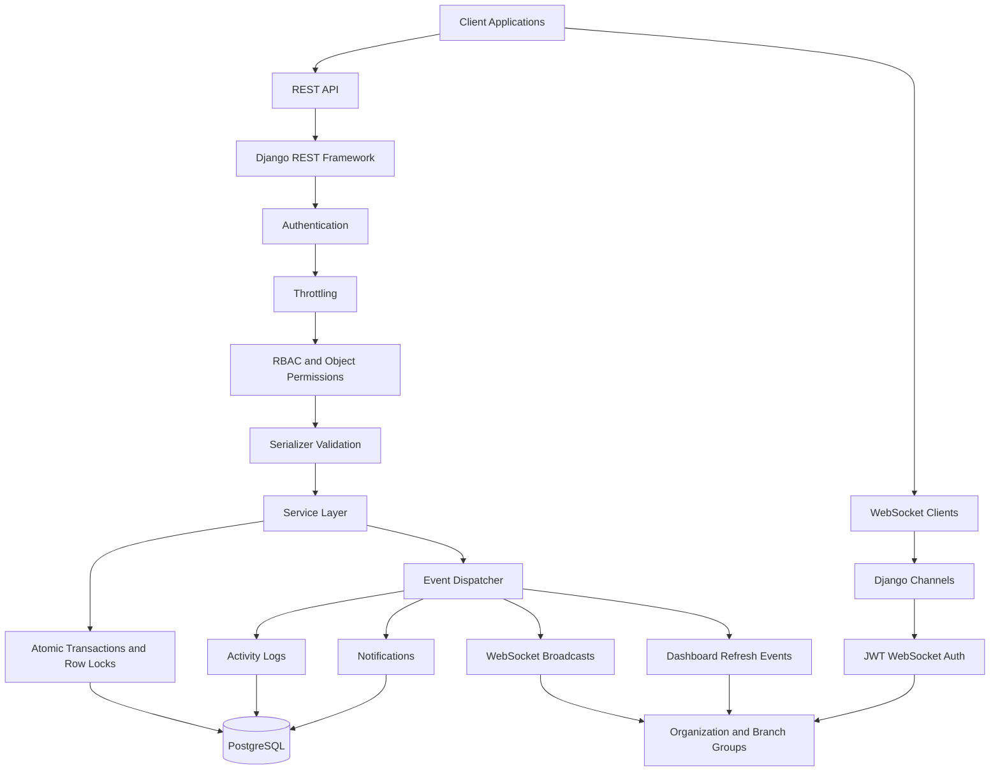
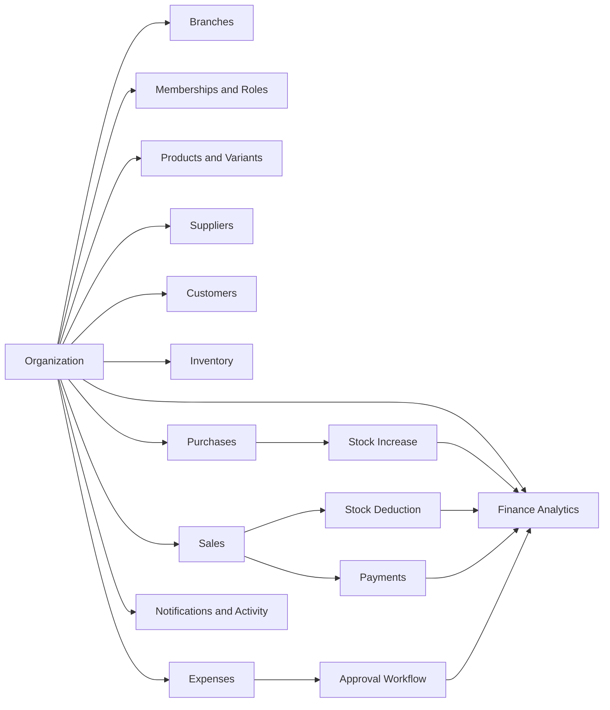
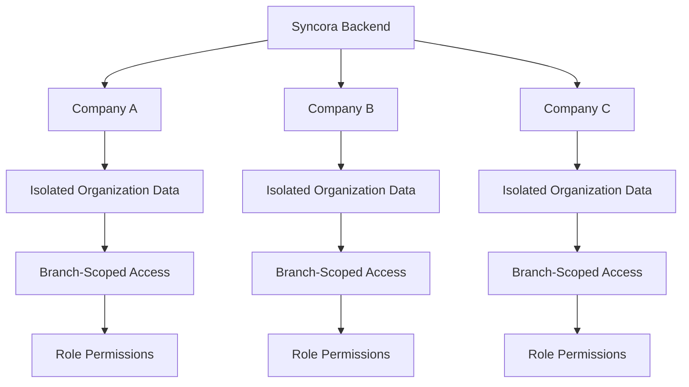
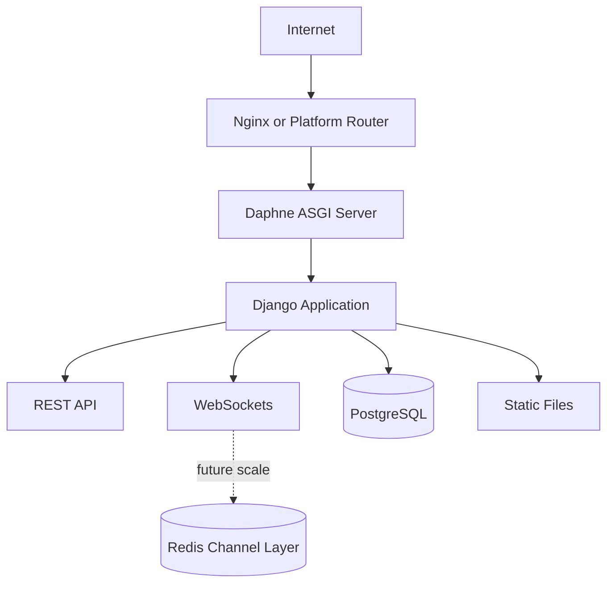

# System Architecture

Syncora is organized around a tenant-isolated Django backend with REST APIs, WebSocket updates, transactional service logic, and PostgreSQL persistence.

## Backend Flow

## Business Modules

## Multi-Tenant Isolation

## Production Shape

