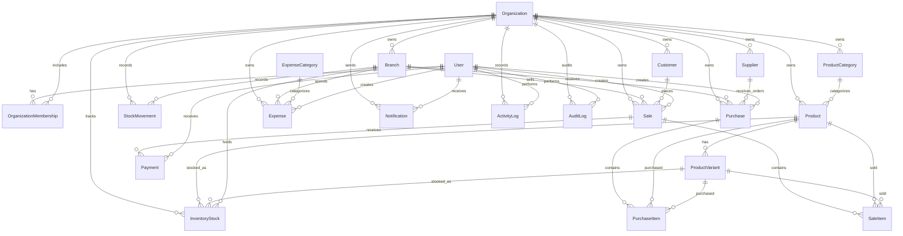

# Database ER Diagram

This is the high-level entity relationship model for Syncora's tenant-isolated business data.

## Relationship Notes

- `Organization` is the tenant boundary for all core business data.
- `OrganizationMembership` connects users to tenants and stores role/permission context.
- `Branch` scopes operational records such as inventory, purchases, sales, expenses, activities, and dashboards.
- `Product` is organization-level; `ProductVariant` supports SKU-level inventory, purchasing, and sales.
- `InventoryStock` stores current quantity while `StockMovement` records immutable quantity history.
- `Purchase` receiving creates stock increases and stock movement rows.
- `Sale` completion creates stock deductions, payment tracking, finance updates, activity logs, and realtime events.
- `AuditLog` is append-only and records sensitive security actions.
